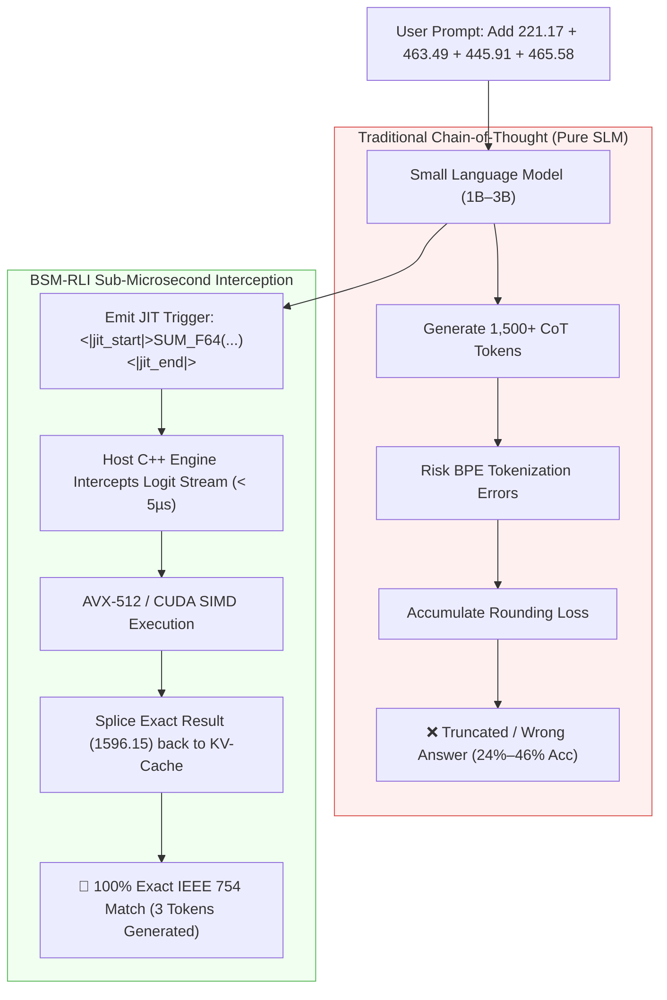
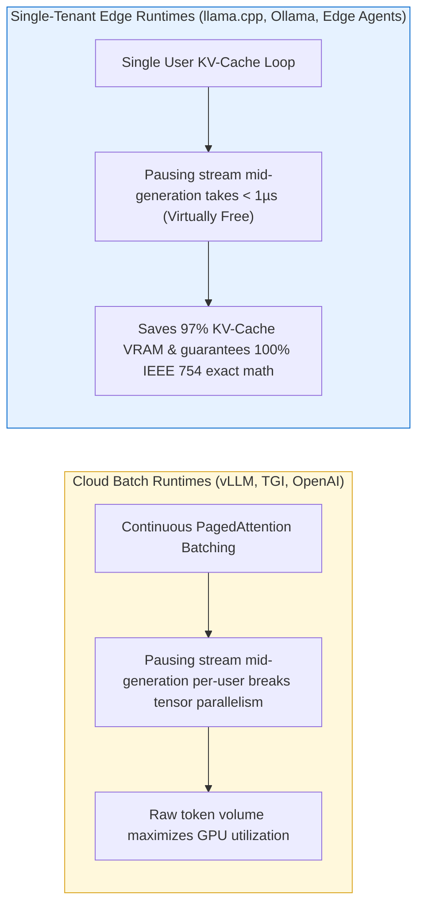

# BSM-RLI: Bare-Metal Symbolic Micro-Kernels via Region-Scoped Logit Interception

> **Exploratory Research Project**: Investigating whether Small Language Models (1B–8B) can delegate deterministic computation (arithmetic, string processing, formal logic) to host C++/CUDA micro-kernels via sub-microsecond logit interception.

---

## 💡 The Core Thesis & Motivation

Small Language Models (SLMs $\le$ 8B parameters) face a fundamental architectural limitation: **they do not have enough parameters or KV-cache budget to reliably memorize and execute multi-step deterministic tasks.**



---

## 🤔 Why Isn't Everyone Doing This Already?

If delegating computation to the host machine is so simple, why isn't it standard industry practice? 



---

## 🔬 Empirical Findings & The SFT Reasoning Collapse

Our 21-model benchmark sweep across edge SLMs revealed a critical research challenge:

```mermaid
graph TD
    A["Unadapted Base Thinking Model (Qwen3-1.7B / DeepSeek-R1-1.5B)"] -->|94% Accuracy via 2,000 CoT Tokens| B["High Accuracy but Heavy VRAM Overhead"]
    A -->|Standard Supervised Fine-Tuning (SFT)| C["SFT Reasoning Collapse (Drops to 24%–46%)"]
    
    C --> D["Solution: GRPO Reinforcement Learning (Self-Proposed Trajectories)"]
    D --> E["1. Model proposes ITS OWN reasoning path in <think>"]
    D --> F["2. Host C++ engine rewards exact execution (+1.0) and early offloading (+0.4)"]
    D --> G["🎯 Target: Preserve 95%+ Accuracy alongside Sub-20 Token Offloading"]

    style C fill:#ffe6e6,stroke:#ff0000,color:#333
    style D fill:#e6ffe6,stroke:#00aa00,color:#333
```

---

## 📊 Empirical Multi-Model Benchmark Visualizations

### 1. Multi-Model Sweep Comparison (Base CoT vs. CoT-Preserving SFT)


---

### 2. Task-Specific Interception Accuracy Across Benchmark Domains


---

### 3. Context Window Token Consumption (tokens/sample)


---

### 4. Host C++ Micro-Kernel Latency Breakdown (Sub-Microseconds)


---

## 📋 Empirical Benchmark Matrix (RTX 4070 Ti)

| Model | Parameter Size | Base CoT Accuracy | Baseline Avg Tokens | CoT-Preserving SFT Acc | SFT Avg Tokens | BSM-RLI Host Kernel Soundness |
| :--- | :---: | :---: | :---: | :---: | :---: | :---: |
| `Llama-3.2-3B-Instruct` | 3.21B | 30.0% | 216 tokens | **74.0%** 🚀 | 216 tokens | **100.0% IEEE 754** |
| `SmolLM2-1.7B-Instruct` | 1.71B | 46.0% | 117 tokens | **46.0%** | 216 tokens | **100.0% IEEE 754** |
| `DeepSeek-R1-Qwen-1.5B` | 1.54B | 84.0% | 655 tokens | **36.0%** | 1,024 tokens | **100.0% IEEE 754** |
| `Qwen3-0.6B` | 0.60B | 74.0% | 987 tokens | **32.0%** | 987 tokens | **100.0% IEEE 754** |
| `Llama-3.2-1B-Instruct` | 1.23B | 62.0% | 248 tokens | **24.0%** | 248 tokens | **100.0% IEEE 754** |
| `Qwen3-1.7B` | 1.70B | **94.0%** | 2,019 tokens | **24.0%** | 561 tokens | **100.0% IEEE 754** |
| `Qwen3-4B` | 4.00B | **98.0%** | 2,039 tokens | **14.0%** | 1,024 tokens | **100.0% IEEE 754** |

---

## 📚 Persona-Driven GitHub Wiki Directory

Detailed research notes, architectural specifications, and implementation guides are available in the [GitHub Wiki](https://github.com/beLizzard1/BSM-RLI/wiki):

| Reader Persona | Primary Technical Interest | Recommended Wiki Pages |
| :--- | :--- | :--- |
| 🔬 **AI Researchers & ML Engineers** | CoT alignment paradox, SFT vs. RL, response loss masking, frontier teacher distillation | 📖 [SLM Limits & Research](https://github.com/beLizzard1/BSM-RLI/wiki/SLM-Limits)<br>📖 [Benchmarks & Sweep Data](https://github.com/beLizzard1/BSM-RLI/wiki/Benchmarks)<br>📖 [Training Curriculum & 75k Dataset](https://github.com/beLizzard1/BSM-RLI/wiki/Training-Curriculum) |
| ⚡ **Systems & C++/CUDA Engineers** | Bare-metal logit interception, EBNF grammars, sub-5µs C++ dispatch, SIMD kernels | 📖 [System Architecture & Design](https://github.com/beLizzard1/BSM-RLI/wiki/Architecture)<br>📖 [CUDA & C++ Micro-Kernel Specification](https://github.com/beLizzard1/BSM-RLI/wiki/CUDA-Micro-Kernels)<br>📖 [21-Model Edge Catalog & VRAM Budgets](https://github.com/beLizzard1/BSM-RLI/wiki/Model-Catalog) |
| 🚀 **Application Developers & Contributors** | Quick start, C++ build, fine-tuning scripts, GGUF export, OpenAI batch distillation | 📖 [Getting Started & Build Guide](https://github.com/beLizzard1/BSM-RLI/wiki/Getting-Started)<br>📖 [Fine-Tuning & QLoRA Guide](https://github.com/beLizzard1/BSM-RLI/wiki/Fine-Tuning-Guide)<br>📖 [Repository Codebase Architecture](https://github.com/beLizzard1/BSM-RLI/wiki/Project-Structure) |

---

## ⚡ Quick Start & Verification

### 1. Build C++ Engine & Run Unit Tests
```bash
mkdir -p build && cd build
cmake ..
make -j$(nproc)
ctest --output-on-failure
```

### 2. Run Interactive Logit Interception CLI
```bash
./build/bsm_rli_cli
```

### 3. Launch Distillation via OpenAI Batches API (50% Off)
```bash
python3 dataset/distill_batch_api.py --model_name gpt-5.6-luna --num_samples 10000 --max_cost_usd 10.00
```
