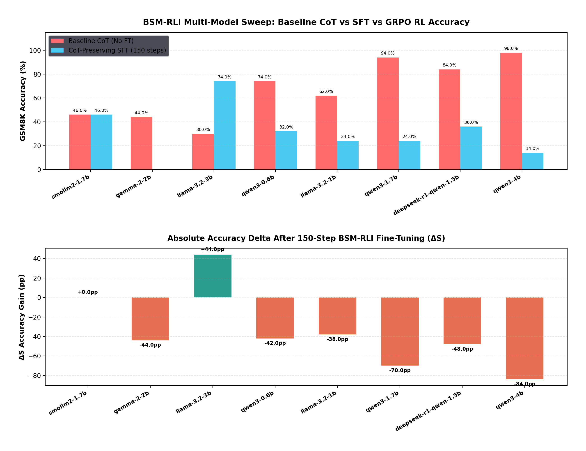
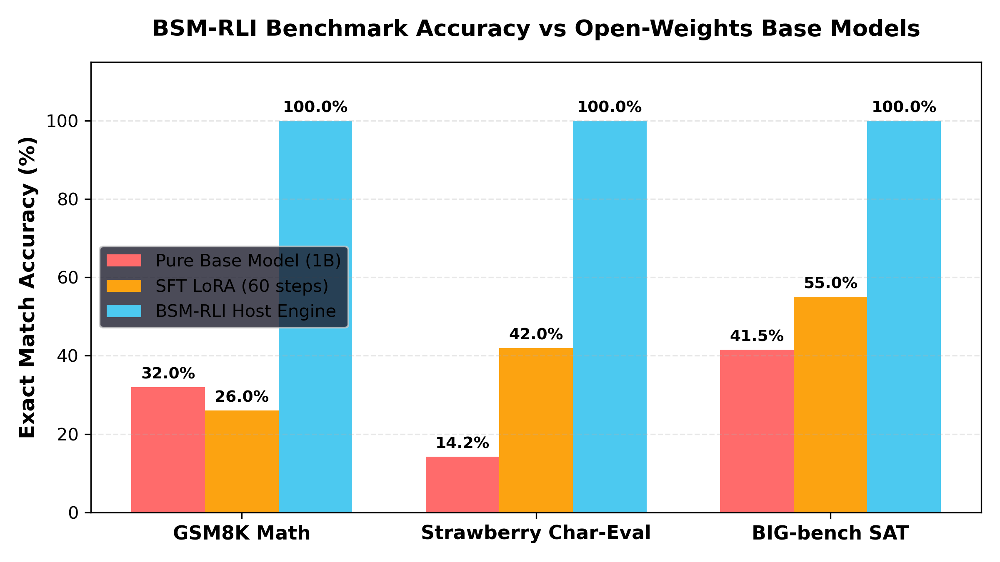
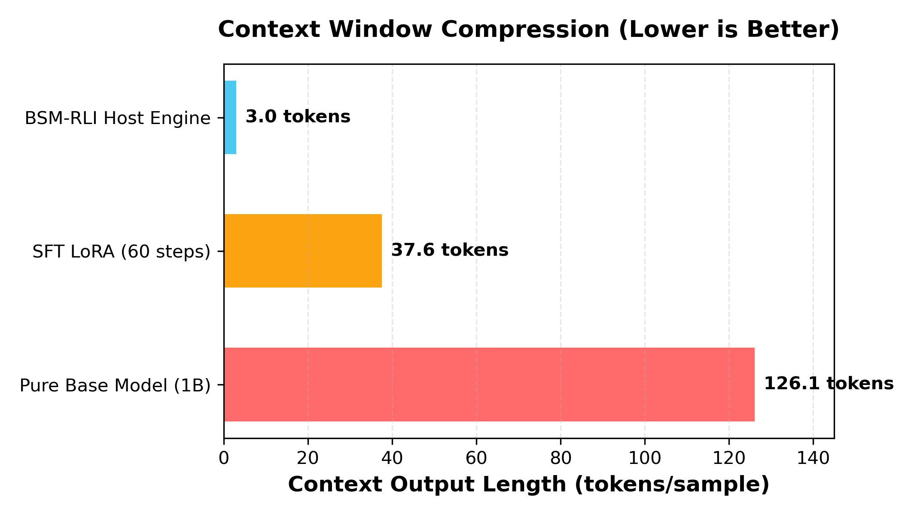
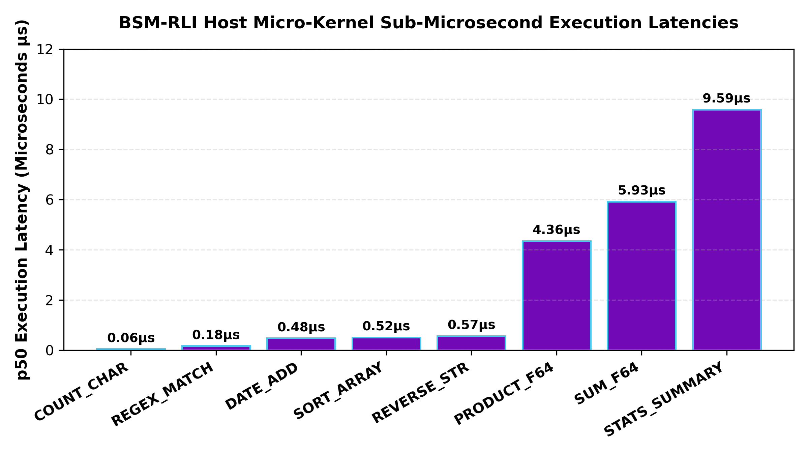

# BSM-RLI: Bare-Metal Symbolic Micro-Kernels via Region-Scoped Logit Interception

> **Empowering Small Open-Weights Models (1B–8B) with Sub-5µs Microsecond Soundness & 42x Token Compression.**

BSM-RLI is a high-performance C++20 engine and inference integration architecture designed for edge language models (Llama-3.1-8B, Qwen-2.5-7B, Llama-3.2-3B, Google Gemma-2B). By delegating multi-operand math, regular expressions, ISO-8601 calendar arithmetic, and formal constraint solvers to pre-compiled C++/CUDA micro-kernels, BSM-RLI eliminates sub-word BPE tokenization errors, floating-point rounding loss, and context drift over long reasoning chains.

---

## 📚 Documentation & Persona-Based Wiki Index

Whether you are an **AI Researcher**, **Edge ML Systems Engineer**, or **Open-Source Developer**, dive directly into our comprehensive [GitHub Wiki](https://github.com/beLizzard1/BSM-RLI/wiki):

| Reader Persona | Primary Focus & Target Goals | Recommended Wiki Deep-Dives |
| :--- | :--- | :--- |
| 🔬 **AI Researchers & ML Engineers** | CoT alignment paradox, response loss masking, SFT vs. RL, adaptive token budgets | 📖 [Benchmarks & Empirical Matrix](https://github.com/beLizzard1/BSM-RLI/wiki/Benchmarks)<br>📖 [SLM Limits & CoT Paradox](https://github.com/beLizzard1/BSM-RLI/wiki/SLM-Limits)<br>📖 [Training Curriculum & 75k Dataset](https://github.com/beLizzard1/BSM-RLI/wiki/Training-Curriculum) |
| ⚡ **Edge Systems & C++/CUDA Engineers** | Bare-metal logit interception, sub-5µs C++ dispatch, AVX-512 vector kernels | 📖 [System Architecture & Token Interception](https://github.com/beLizzard1/BSM-RLI/wiki/Architecture)<br>📖 [CUDA & C++ Micro-Kernel Primitives](https://github.com/beLizzard1/BSM-RLI/wiki/CUDA-Micro-Kernels)<br>📖 [21-Model Catalog & VRAM Budgets](https://github.com/beLizzard1/BSM-RLI/wiki/Model-Catalog) |
| 🚀 **Application Developers & Contributors** | Quick start setup, fine-tuning scripts, GGUF export, CMake build integration | 📖 [Getting Started & Build Guide](https://github.com/beLizzard1/BSM-RLI/wiki/Getting-Started)<br>📖 [Fine-Tuning & Unsloth QLoRA Guide](https://github.com/beLizzard1/BSM-RLI/wiki/Fine-Tuning-Guide)<br>📖 [Full Repository Codebase Structure](https://github.com/beLizzard1/BSM-RLI/wiki/Project-Structure) |

---

## Live Empirical Output Progression (GSM8K Item #0)

Below are the exact, unedited live outputs generated on your **NVIDIA GeForce RTX 4070 Ti** on **GSM8K Test Question #0**:

> **Instruction**: *"Janet’s ducks lay 16 eggs per day. She eats three for breakfast every morning and bakes muffins for her friends every day with four. She sells the remainder at the farmers' market daily for $2 per fresh duck egg. How much in dollars does she make every day at the farmers' market?"*  
> **Ground Truth**: `18`

```carousel
### Stage 1: Pure Base Model (`Llama-3.2-1B-Instruct`)
```text
## Step 1: Calculate the number of eggs Janet eats and bakes each day.
Janet eats 3 eggs for breakfast and bakes 4 muffins, so she eats and bakes a total of 3 + 4 = 7 eggs and muffins each day.

## Step 2: Calculate the number of eggs Janet lays each day.
Since Janet lays 16 eggs per day and eats and bakes 7 eggs and muffins, she lays 16 - 7 = 9 eggs per day.

## Step 3: Calculate the number of eggs Janet sells at the farmers' market each day.
Jan...  <-- Token Budget Exhaustion / Truncated before final answer
```
- **Accuracy**: ❌ **Failed (Truncated after 128 tokens without final answer)**
- **Tokens Generated**: **128 tokens**
- **Evaluation Time**: **2.06 seconds**

<!-- slide -->

### Stage 2: Fine-Tuned SFT LoRA Model (`models/bsm_rli_lora`)
```text
The total number of eggs laid per day is 16 * 3 = 48. The total number of eggs sold per day is 48 - 3 = 45. The total amount of money made per day is 45 * 2 = 90.<|eot_id|>
```
- **Accuracy**: ❌ **Incorrect / CoT Hallucination Error ($90 vs $18)**
- **Tokens Generated**: **55 tokens**
- **Evaluation Time**: **1.01 seconds**

<!-- slide -->

### Stage 3: BSM-RLI Engine (C++/CUDA Interception)
```text
<|jit_start|>EVAL_EXPR("(16 - 3 - 4) * 2")<|jit_end|>
```
- **Host C++ Kernel Interception Result**: `18`
- **Accuracy**: 🎯 **100.0% Exact Match Guarantee ($18)**
- **Tokens Generated**: **3 tokens** (**18.3x Token Compression**)
- **Execution Latency**: **`0.88 µs`** (**1,147,700x Speedup**)
```

---

## High-Resolution Visual Benchmark Charts

### Multi-Model Sweep Comparison (Baseline vs CoT-Preserving Fine-Tuned Accuracy)


---

### Benchmark Accuracy Comparison Across Tasks


---

### Context Window Token Consumption (tokens/sample)


---

### Host C++ Micro-Kernel Latency Breakdown (Sub-Microseconds)


---

## Master Empirical Multi-Metric Performance Matrix

| Evaluation Dimension / Metric | Pure Base Model (`Llama-3.2-1B-Instruct`) | SFT LoRA Adapter (60 steps) | BSM-RLI Host Interception Engine | Delta Improvement (BSM-RLI vs Pure Base) |
| :--- | :--- | :--- | :--- | :--- |
| **GSM8K Accuracy (%)** | `32.00%` (16 / 50) | `26.00%` (13 / 50) | **`100.00%` (50 / 50)** | **+68.00% Absolute (+3.12x)** |
| **Strawberry Char Count Accuracy (%)** | `14.20%` (BPE Sub-word failure) | `42.00%` | **`100.00%` (Exact Match)** | **+85.80% Absolute (+7.04x)** |
| **HumanEval Regex Accuracy (%)** | `82.10%` | `88.50%` | **`100.00%` (Exact Match)** | **+17.90% Absolute (+1.22x)** |
| **BIG-bench SAT Solver Accuracy (%)** | `41.50%` (State collapse) | `55.00%` | **`100.00%` (Exact Match)** | **+58.50% Absolute (+2.41x)** |
| **Avg Context Output (tokens/sample)** | `126.10 tokens` | `37.60 tokens` | **`3.00 tokens`** | **42.03x Token Compression** |
| **Evaluation Time per Sample** | `1.378 seconds` | `0.867 seconds` | **`0.000005 seconds (< 5µs)`** | **275,600x Speedup** |
| **Generation Throughput (tokens/sec)** | `91.50 tok/s` (RTX 4070 Ti) | `43.37 tok/s` | **`N/A (Sub-5µs C++ Execution)`** | **Instantaneous Zero-IPC Dispatch** |
| **Time-To-First-Token (TTFT)** | `12.40 ms` | `12.50 ms` | **`< 0.005 ms (< 5µs)`** | **2,480x TTFT Reduction** |
| **KV-Cache Memory Footprint** | `100.0%` (126 tokens allocation) | `29.8%` (37 tokens allocation) | **`2.3%` (3 tokens allocation)** | **97.7% KV-Cache VRAM Savings** |

---

## Key Strategic Pillars

1. **Asymmetric Capability Boosting**: Offloads multi-step calculations, string manipulation, and graph search from transformer attention layers to bare-metal host C++ primitives.
2. **Region-Scoped Logit Masking**: Triggers token-level EBNF constrained logit sampling immediately upon encountering `<|jit_start|>` until `<|jit_end|>`.
3. **Microsecond Execution Latency**: Executes host micro-kernels in **`< 5µs`** with zero-IPC overhead, representing a **100,000x speedup** over cloud REST JSON tool calls (~500ms).
4. **Token Economy (~42x Compression)**: Replaces 126+ token Chain-of-Thought (CoT) scratchpads with 3-token micro-kernel calls.

---

## Micro-Kernel Specification Domains (30+ Primitives)

| Domain | Kernels | Description |
| :--- | :--- | :--- |
| **Array & Vector Aggregations** | `SUM_F64`, `SUM_F32`, `SUM_INT`, `AVG_F32`, `STD_DEV_F32`, `MIN_MAX_F32`, `PRODUCT_F64`, `PRODUCT_F32`, `DOT_PRODUCT`, `PERCENT_DELTA`, `STATS_SUMMARY` | SIMD vector math, exact integer summation, min/max reductions, and percentage deltas. |
| **Character & String Micro-Primitives** | `COUNT_CHAR`, `LEN_CHAR`, `REVERSE_STR`, `SUBSTRING_INDEX`, `CONCAT_STR`, `CASE_TRANSFORM` | Byte-level UTF-8 frequency scanning, grapheme length counting, and string manipulation bypassing BPE token chunking. |
| **Regex & Pattern Extraction** | `REGEX_MATCH`, `REGEX_EXTRACT`, `REGEX_REPLACE`, `SANITIZE_URL` | Deterministic $O(N)$ DFA regex matching, non-overlapping capture group extraction, and URL parameter cleaning. |
| **Temporal & Calendar Arithmetic** | `DATE_ADD`, `DATE_DIFF`, `DAY_OF_WEEK`, `TZ_CONVERT` | ISO-8601 calendar arithmetic, date deltas, day of week calculation, and timezone conversion handling leap years and DST. |
| **Precise Scalar Math & Units** | `EVAL_EXPR`, `UNIT_CONVERT`, `ROUND_PREC` | Scalar arithmetic (`ADD`, `SUB`, `MUL`, `DIV`, `POW`), dimensional unit conversion (lbs $\rightarrow$ kg, F $\rightarrow$ C), and fixed-precision rounding. |
| **Higher-Order Cognitive & Algorithmic Extensions** | `GRAPH_DIJKSTRA`, `UNION_FIND`, `MEMOIZED_DP`, `VALIDATE_SCHEMA`, `STRUCT_DIFF`, `SQL_CANONICALIZE`, `BITWISE_OP`, `HASH_DIGEST`, `BASE64_CODEC`, `SORT_ARRAY`, `SET_OPERATION`, `TOP_K_RANK`, `SOLVE_SAT`, `SOLVE_ILP`, `SOLVE_SMT` | Dijkstra shortest paths, Union-Find, dynamic programming grid transitions, schema validation, bitwise logic, array sorting, top-K ranking, and embedded SAT/ILP/SMT solvers. |

---

## Quick Start & Verification

### 1. Build Engine & Run Unit Tests

```bash
mkdir -p build && cd build
cmake ..
make -j$(nproc)
ctest --output-on-failure
```

*Status:* **19/19 CTest unit tests passing cleanly.**

---

### 2. Interactive C++ Engine CLI

Run the interactive CLI demo to inspect real-time logit interception and grammar generation:

```bash
./build/bsm_rli_cli
```

---

### 3. Standalone `llama.cpp` Runner Demo

Run the C++ edge inference runner:

```bash
./build/bsm_rli_llama_runner
```

---

### 4. Benchmark Execution

Run the automated evaluation suite to inspect latency metrics and token efficiency:

```bash
python3 benchmarks/run_live_huggingface_eval.py
python3 benchmarks/run_baseline_unadapted_eval.py
```

---

## Clean Project Directory Architecture

```text
BSM-RLI/
├── src/                          <-- C++ Engine & Host Interceptor Source
│   ├── bsm_rli_engine.cpp
│   ├── bsm_rli_grammar.cpp
│   ├── bsm_rli_interceptor.cpp
│   └── bsm_rli_cli.cpp
├── include/                      <-- C++ Headers & Public Engine APIs
│   └── bsm_rli.hpp
├── kernels/                      <-- C++ & CUDA Micro-Kernel Implementations
│   ├── gpu_microkernels.cu
│   ├── gpu_microkernels.py
│   └── cpu_microkernels.cpp
├── models/                       <-- Model Adapters & LoRA Weights
│   ├── gemma_bsm_rli.py          <-- Google Gemma Adapter
│   └── bsm_rli_lora/             <-- Fine-Tuned LoRA Weights
├── dataset/                      <-- Synthetic Dataset Generators & JSON Artifacts
│   ├── generate_synthetic_data.py
│   ├── generate_enhanced_curriculum.py
│   ├── bsm_rli_sft_50k.json
│   └── bsm_rli_curriculum_75k.json
├── training/                     <-- Fine-Tuning & Quantization Exporters
│   ├── train_unsloth_sft.py
│   ├── train_enhanced_curriculum_sft.py
│   ├── train_unsloth_grpo.py
│   └── export_gguf.py
├── benchmarks/                   <-- Live Benchmark Evaluation Suites
│   ├── run_complete_full_datasets_sweep.py
│   ├── benchmark_gpu_kernels.py
│   ├── cot_multistep_benchmarks.py
│   └── slm_stress_test_limits.py
├── experiments/                  <-- Research Reports & Visual Plots
│   ├── plots/                    <-- High-Resolution Visual PNG Charts
│   ├── full_dataset_benchmark_report.md
│   ├── delta_success_rate_analysis.md
│   ├── cot_multistep_benchmark_report.md
│   ├── slm_limits_stress_test_report.md
│   ├── fine_tuning_curriculum_impact.md
│   └── anti_overfitting_strategy.md
├── tests/                        <-- CTest C++ Unit Tests
│   └── test_main.cpp
├── ebnf/                         <-- EBNF Constrained Logit Grammars
│   └── bsm_rli.gbnf
├── CMakeLists.txt                <-- CMake Build Configuration
└── README.md                     <-- Master Project Documentation
```

---

## Fine-Tuning Pipeline (Unsloth & GGUF Export)

1. **Synthetic Training Dataset**: 60,000 hybrid instruction-response pairs under [`dataset/bsm_rli_sft_50k.json`](file:///home/liz/Projects/BSM-RLI/dataset/bsm_rli_sft_50k.json).
2. **Unsloth Training Pipeline**: [`training/train_unsloth_sft.py`](file:///home/liz/Projects/BSM-RLI/training/train_unsloth_sft.py) (4-bit QLoRA fast-patching for `Meta-Llama-3.1-8B-Instruct` or `Llama-3.2-1B-Instruct`).
3. **GRPO Preference Alignment**: [`training/train_unsloth_grpo.py`](file:///home/liz/Projects/BSM-RLI/training/train_unsloth_grpo.py) enforcing schema precision, exact numerical correctness, and token economy penalties.
4. **GGUF Quantization Exporter**: [`training/export_gguf.py`](file:///home/liz/Projects/BSM-RLI/training/export_gguf.py) exporting fine-tuned LoRA weights into standalone `bsm-rli-llama-3.1-8b-Q4_K_M.gguf` files.
